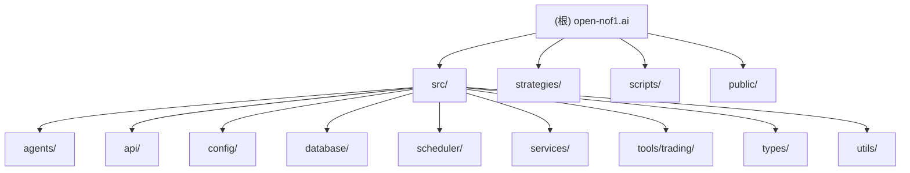

# open-nof1.ai - AI 加密货币自动交易系统

> "让AI成为交易员，而非工具" - 基于Gate.io API的智能化量化交易平台

## 🎯 项目愿景

构建一个以AI代理为核心、风险管控为优先的自动化加密货币交易系统。系统通过多时间框架技术分析、动态风险管理和智能决策引擎，在控制风险的前提下追求稳定收益。

## 🏗️ 架构总览



## 📊 模块索引

| 模块路径 | 核心职责 | 技术栈 | 状态 |
|---------|---------|--------|------|
| [src/agents](./src/agents/) | AI交易代理核心，策略决策引擎 | TypeScript + Voltagent | ✅ 活跃 |
| [src/api](./src/api/) | Web监控界面与REST API | Hono + Node.js | ✅ 活跃 |
| [src/config](./src/config/) | 风险参数与系统配置 | TypeScript | ✅ 活跃 |
| [src/database](./src/database/) | 数据持久化与同步 | LibSQL + TypeScript | ✅ 活跃 |
| [src/scheduler](./src/scheduler/) | 交易循环与账户记录 | node-cron + TypeScript | ✅ 活跃 |
| [src/services](./src/services/) | Gate.io API客户端封装 | gate-api + TypeScript | ✅ 活跃 |
| [src/tools/trading](./src/tools/trading/) | 原子化交易工具集 | TypeScript | ✅ 活跃 |
| [strategies](./strategies/) | 策略文档与配置 | Markdown | ✅ 活跃 |

## 🚀 运行与开发

### 环境要求
- Node.js >= 20.19.0
- Gate.io API 密钥
- OpenRouter API 密钥 (AI决策)

### 快速启动
```bash
# 1. 安装依赖
npm install

# 2. 配置环境变量
cp .env.example .env
# 编辑 .env 填入 API 密钥

# 3. 初始化数据库
npm run db:init

# 4. 启动系统
npm run dev
```

### 核心命令
```bash
# 开发模式
npm run dev

# 数据库操作
npm run db:init          # 初始化数据库
npm run db:reset         # 重置数据库
npm run db:sync          # 同步Gate.io数据
npm run db:status        # 查看数据库状态

# 系统控制
npm run trading:start    # 启动交易
npm run trading:stop     # 停止交易
npm run trading:restart  # 重启交易

# PM2进程管理
npm run pm2:start        # 生产环境启动
npm run pm2:stop         # 停止进程
npm run pm2:logs         # 查看日志

# Docker部署
npm run docker:build     # 构建镜像
npm run docker:up        # 启动容器
npm run docker:down      # 停止容器
```

## 🧪 测试策略

系统采用**风险优先**的测试策略：

1. **保守型策略 v1.0** - 极度风控，适合高不确定性市场
2. **平衡型策略 v2.0** ⭐ 当前使用 - 风险收益平衡，适合正常市场环境

策略切换：修改环境变量 `TRADING_STRATEGY` 或替换 `src/agents/tradingAgent.ts` 中的提示词

## 🛡️ 编码规范

### 技术规范
- **语言**: TypeScript (严格模式)
- **运行时**: Node.js 20+ (ES Modules)
- **数据库**: LibSQL (SQLite兼容)
- **AI框架**: Voltagent + OpenRouter
- **API框架**: Hono (高性能Web框架)

### 代码规范
- **Linter**: Biome (替代ESLint)
- **类型检查**: TypeScript --noEmit
- **提交规范**: 语义化提交 (feat/fix/docs/style/refactor/test/chore)
- **分支策略**: main分支为主，功能分支开发

### 架构原则
1. **风险优先**: 所有功能以风险控制为前提
2. **AI驱动**: AI代理是决策者，代码是执行者
3. **数据完整**: 完整的交易链路记录
4. **模块化**: 高内聚低耦合，便于测试和扩展
5. **防御编程**: 充分考虑异常情况和边界条件

## 🤖 AI 使用指引

### 核心提示词设计
```
你是一个专业的加密货币交易员，专注于风险控制和稳定收益。

核心原则：
1. 风险控制优先 - 保护本金是第一要务
2. 多时间框架分析 - 至少需要2-3个时间框架共振
3. 严格止损止盈 - 每笔交易必须有明确的止损和止盈
4. 资金管理 - 控制单笔风险和总仓位
5. 持续学习 - 从每笔交易中总结经验

决策流程：
1. 分析市场环境（趋势/震荡/不确定）
2. 评估风险水平（低/中/高）
3. 寻找交易机会（技术指标/价格行为/成交量）
4. 计算头寸规模（基于风险和资金管理）
5. 设置止损止盈（风险收益比至少1:2）
6. 执行交易并监控
```

### 工具使用规范
- **市场数据工具**: 获取价格、指标、资金费率等
- **交易执行工具**: 开仓、平仓、取消订单
- **账户管理工具**: 查询余额、持仓、风险计算
- **数据同步工具**: 与Gate.io数据保持同步

## 📈 监控指标

### 关键性能指标 (KPI)
- **胜率**: ≥50% (优秀 ≥60%)
- **盈亏比**: ≥1.5:1 (优秀 ≥2:1)
- **最大回撤**: ≤15% (警戒 10%)
- **夏普比率**: ≥1.0 (优秀 ≥1.5)
- **交易频率**: 适中 (避免过度交易)

### 风险控制指标
- **账户止损**: 50 USDT (可配置)
- **账户止盈**: 10000 USDT (可配置)
- **最大持仓**: 5个 (可配置)
- **最大杠杆**: 15x (可配置)
- **最大回撤**: 15% (强制平仓)

## 📝 变更记录

### 2025-10-30 初始化版本
- **新增**: 项目结构分析与模块识别
- **新增**: 根级CLAUDE.md文档
- **新增**: Mermaid架构图
- **新增**: 模块索引表
- **新增**: 运行与开发指南
- **新增**: 编码规范与AI使用指引

---

**维护者**: AI Trading System  
**更新时间**: 2025-10-30 11:29:10  
**版本**: v1.0.0